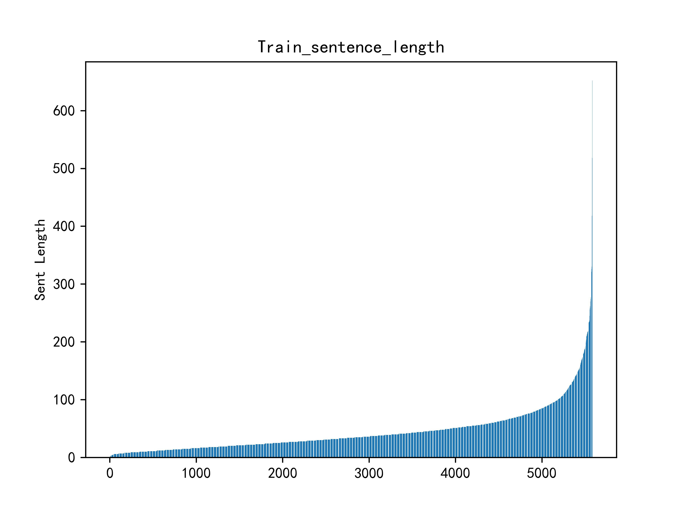
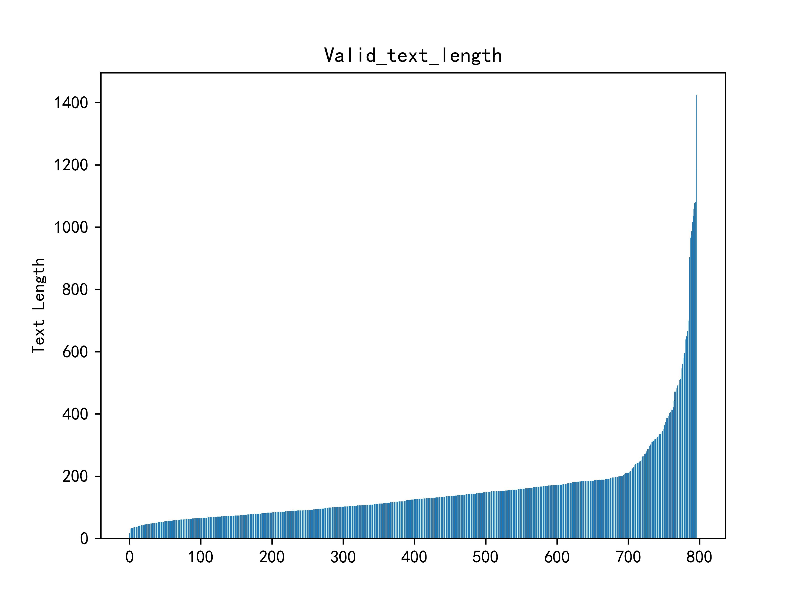
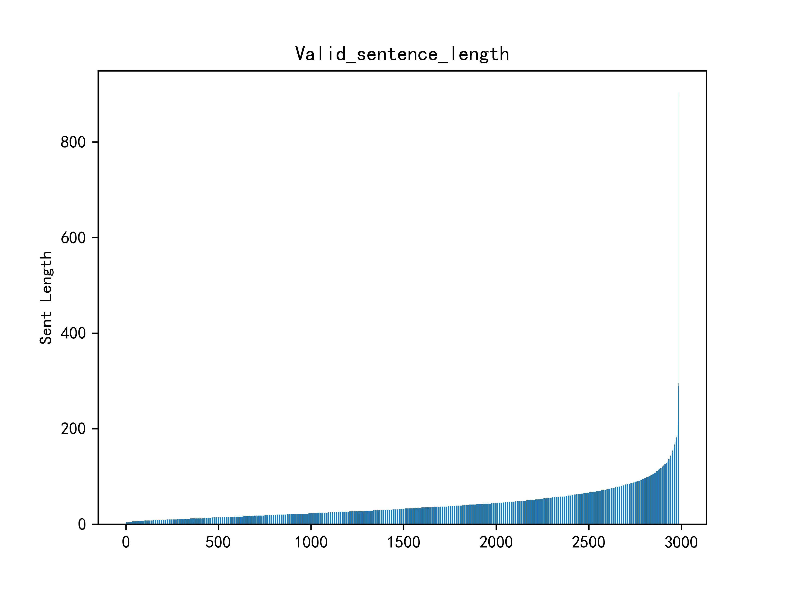
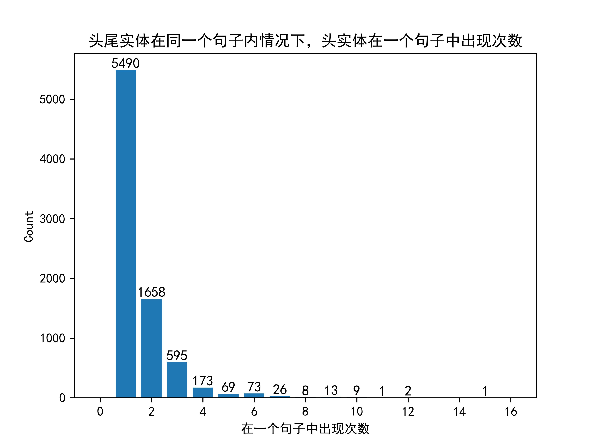
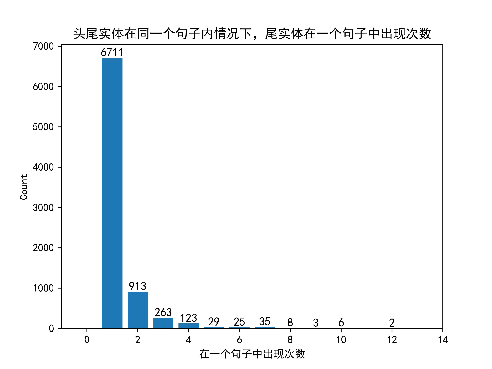
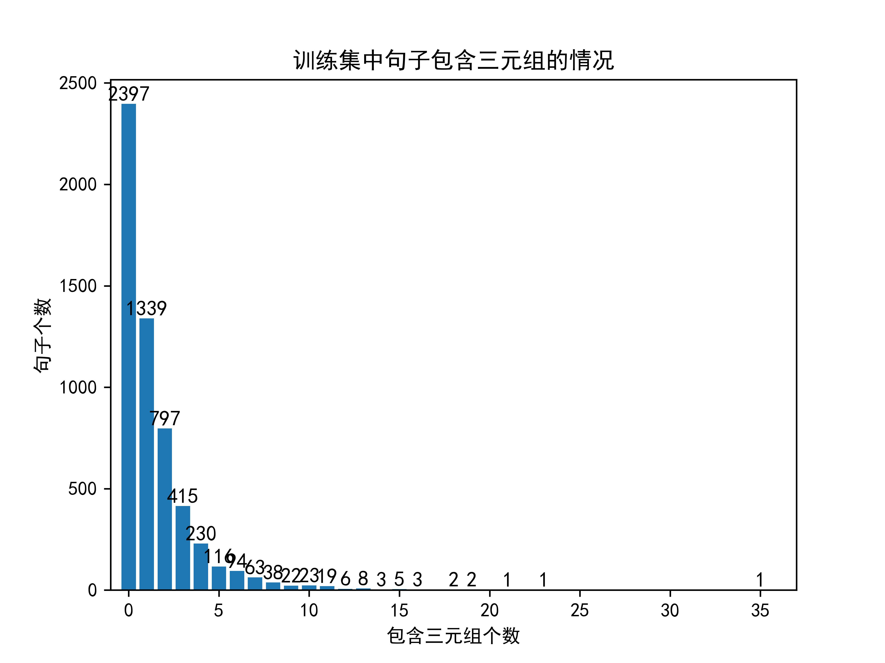

# 原始数据集的基本数据分析
## 1. 训练集的句子长度
部分样本的Text文本过长
长度")
因此对Text文本按照"。"划分，得到句子的长度：

## 2. 验证集的句子长度
验证集Text长度

验证集Sentence长度

## 3. 验证头尾实体是否只会出现在一个完整的句子中

上图的含义：每个三元组的头尾实体，出现在一段Text中的几个句子里。从图中可以看出，每个三元组的头尾实体至少会出现在Text里的一个句子里。

## 4. 同一个句子中实体是否多次出现
当头尾实体在同一个句子中时，确实会出现实体在该句内多次出现

## 5. 训练集中一共包含的relation种类
[具体文件](./save_file/训练集中包含的relations.txt)
>一共有4种关系。  
检测工具  
性能故障  
组成  
部件故障

## 6. 头尾实体的长度
**Notes: 这是去重后统计的结果**
.jpg)
.jpg)

# 7. 是不是每个句子都有一种关系
有大量句子不包含三元组

