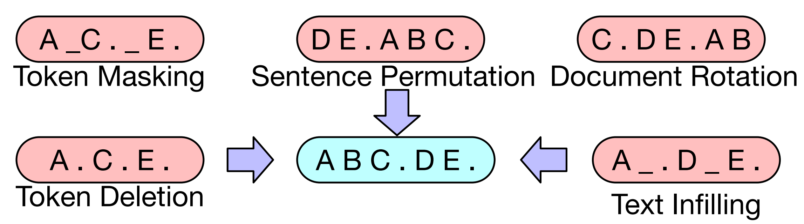

# CCF-BDCI
高端装备制造知识图谱自动化构建技术评测任务代码

## 模型
代码基本模型框架为：BART[^1], 该框架为Encoder-Decoder模块，采用如下方式预训练：


但是因为BART为英文模型，因而本文实际使用的模型结构为: bart-chinese[^2][^3],该模型为复旦大学基于BART原模型实现的中文版本。

## 数据
将原始数据里面的"text"取出作为输入数据，将"spo_list"中的"name"分别取出作为输出数据。
sum_text = 1491
sum_sentence = 5586

```
raw_data:
	"ID": "AT0001",
	"text":"故障现象:车速到100迈以上发动机盖后部随着车速抖动。故障原因简要分析:经技术人员试车；怀疑发动机盖锁或发动机盖铰链松旷。",
	"spo_list":[
		{"h": {"name": "发动机盖", "pos": [14, 18]},
		"t": {"name": "抖动", "pos": [24, 26]},
		"relation": "部件故障"},
		{"h": {"name": "发动机盖锁", "pos": [46, 51]},
		"t": {"name": "松旷", "pos": [58, 60]},
		"relation": "部件故障"},
		{"h": {"name": "发动机盖铰链", "pos": [52, 58]},
		"t": {"name": "松旷", "pos": [58, 60]},
		"relation":"部件故障"}
	]

input_text:
故障现象:车速到100迈以上发动机盖后部随着车速抖动。故障原因简要分析:经技术人员试车；怀疑发动机盖锁或发动机盖铰链松旷。
output_text:
头:发动机盖$$关系:部件故障$$尾:抖动
```

ToDo:

 - 统计头实体，尾实体以及关系长度。
 - 将输入句子按照句号划分个多个字句，然后分别进行预测和识别。
 - 每条样本关系数量预测和bart生成结合。


## 函数
infer.py:
```
infer(args, logger): (推理函数)
Parameters： args 参数组 logger log记录
Returns： preds 推理结果

Get_Entity_Pos(text,entity): (从text中匹配entity位置，不成功返回[-1,0])
Parameters： text 待匹配文本 entity 待匹配实体
Returns： [start,end]

Get_Entity(pred): (对生成结果中的实体进行匹配)
Parameters：pred 为生成模型的生成结果，为list对象
Returns：head_entity,relation,tail_entity 头实体，关系，尾实体

to_submission(predictions): (将模型推理结果转为可提交格式)
Parameters：predictions infer()函数推理结果
Actions：存储submission.json文件
```
utlis.py
```
get_F1_score(train_answers_path,train_predict_path): (获取F1分值)
Parameters: train_answers_path 真实标签json路径 train_predict_path 预测结果json路径
Actions: 打印F1分值
```
## 参考

[^1]: [BART: Denoising Sequence-to-Sequence Pre-training for Natural Language Generation, Translation, and Comprehension](https://arxiv.org/abs/1910.13461)

[^2]: [CPT: A Pre-Trained Unbalanced Transformer for Both Chinese Language Understanding and Generation](https://arxiv.org/pdf/2109.05729.pdf)

[^3]: [fnlp/bart-base-chinese](https://huggingface.co/fnlp/bart-base-chinese)
